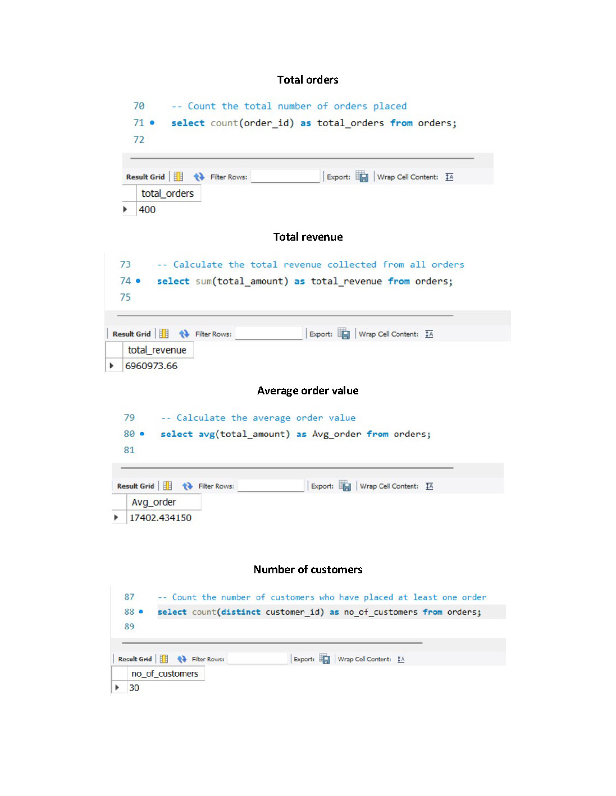
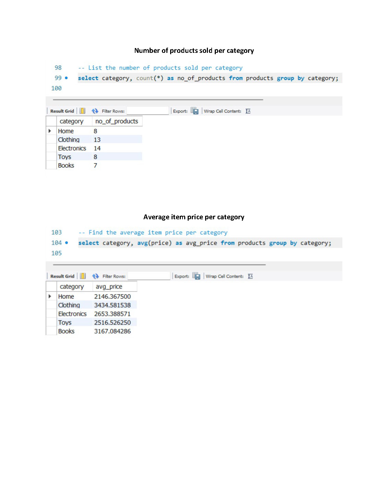

# Retail Store SQL Project

## Overview
This project demonstrates SQL concepts using a Retail Store database system. The project focuses on database design, data analysis, and business-oriented SQL queries.

## Tools Used
- MySQL
- SQL
- DBMS Concepts

## Database Tables
- Customers
- Products
- Orders
- Order Items
- Payments
- Product Reviews

## SQL Concepts Covered
- DDL & DML
- Filtering & Sorting
- Aggregations
- GROUP BY
- INNER JOIN
- LEFT JOIN
- RIGHT JOIN
- Subqueries
- Set Operations

## Business Problems Solved
- Customer Analysis
- Revenue Analysis
- Product Category Analysis
- Inventory Tracking
- Payment Method Analysis
- Order Reporting

## Project Screenshots

### ER Diagram

### Aggregation Queries

### Join Queries

### Subqueries

### Category Analysis

