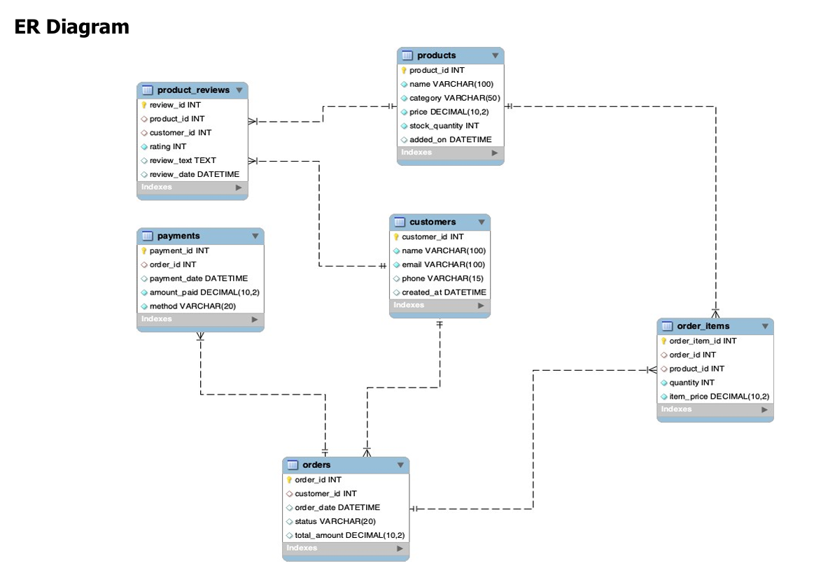
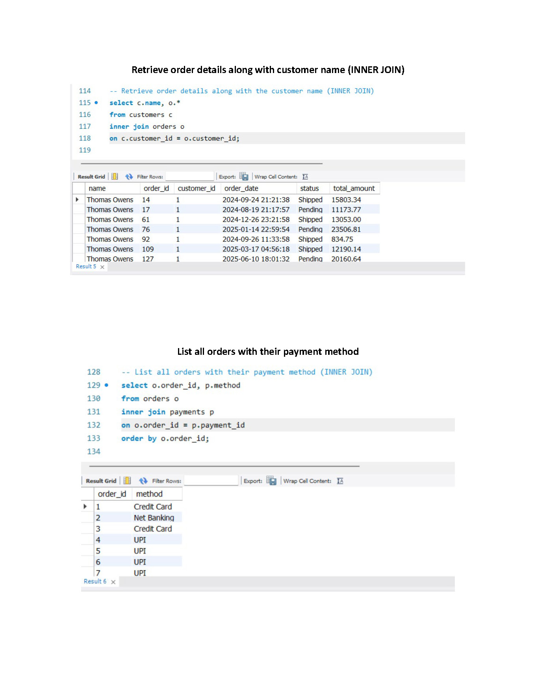
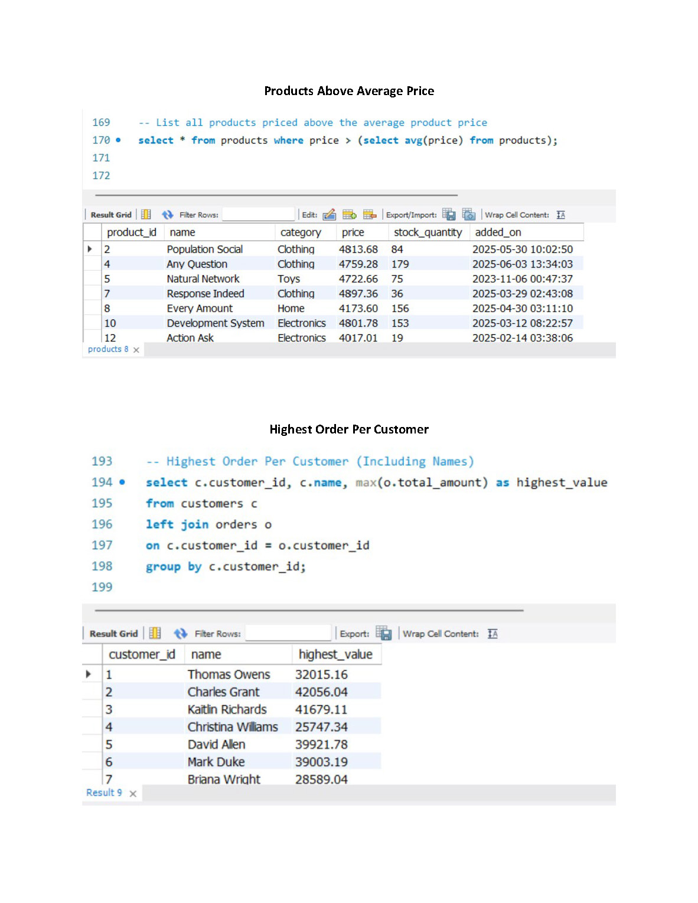

# Retail Store SQL Project

## Overview
This project demonstrates SQL concepts using a Retail Store database system. The project focuses on database design, data analysis, and solving business-oriented problems using SQL queries.

## Tools Used
- MySQL
- SQL
- DBMS Concepts

## Database Tables
- Customers
- Products
- Orders
- Order Items
- Payments
- Product Reviews

## Project Files

| File Name | Description |
|------------|-------------|
| 01_schema.sql | Database schema creation using DDL queries |
| 02_data_insertions.sql | Sample data insertion queries |
| 03_queries.sql | Business queries using SQL concepts |
| 04_project_report.pdf | Complete project documentation |

---

# SQL Concepts Covered

## Level 1: Basics
- SELECT Statements
- WHERE Clause
- DISTINCT
- ORDER BY
- Filtering Conditions

## Level 2: Filtering & Formatting
- IS NULL
- Aliases
- String Concatenation
- Date Formatting
- Arithmetic Operations

## Level 3: Aggregations
- COUNT()
- SUM()
- AVG()
- GROUP BY
- HAVING Clause

## Level 4: Joins
- INNER JOIN
- LEFT JOIN
- RIGHT JOIN
- Multi-table Queries

## Level 5: Subqueries
- Scalar Subqueries
- Nested Queries
- EXISTS / NOT EXISTS

## Level 6: Set Operations
- UNION
- INTERSECT Concepts

---

# Business Problems Solved

- Customer Analysis
- Revenue Analysis
- Product Category Analysis
- Inventory Tracking
- Payment Method Analysis
- Order Reporting

---

# Project Screenshots

## ER Diagram

## Aggregation Queries

## Join Queries

## Subqueries

## Category Analysis

---

# Key Learnings

- Database Design
- Relational Database Management
- Writing Complex SQL Queries
- Business Data Analysis
- Query Optimization Basics
- Reporting & Insights Generation

---

# Author

Shubham  
GitHub: https://github.com/Shubham56123
